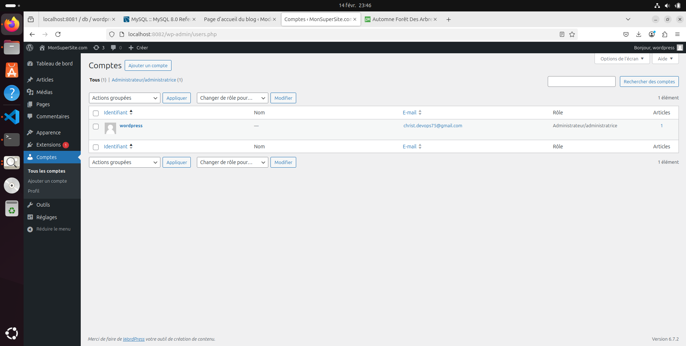
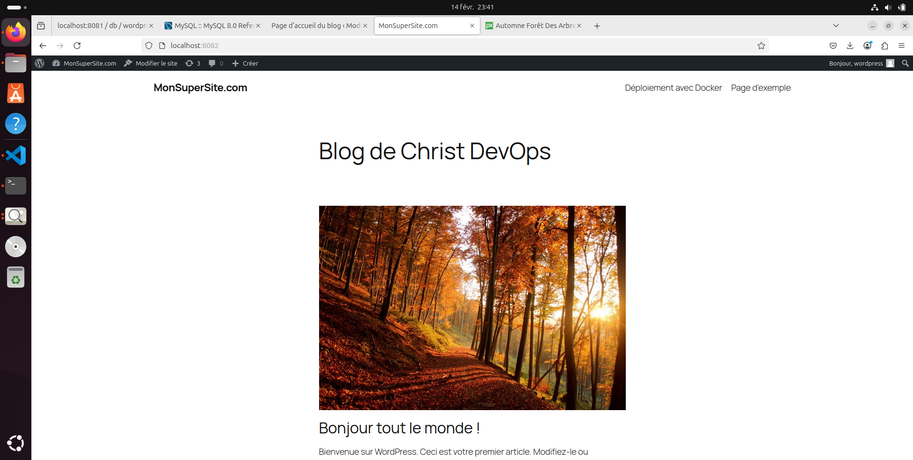

# Déploiement - WordPress avec Docker

#### Prérequis  

* *Logiciels* : Docker et Docker Compose installés sur votre machine.

* *Connaissances* : Notions de base sur Docker, la gestion des volumes et des réseaux.

* *Matériel* : Terminal, éditeur de texte et navigateur web.


## 1. Introduction

Ce document présente le processus de déploiement de WordPress en utilisant Docker et Docker Compose. Il inclut les étapes suivies, les choix de configuration, les difficultés rencontrées et des perspectives d'amélioration.

## 2. Étapes de developpement

Pour commencer, il est essentiel de definir un espace de travail, un dossier dedié à ce projet.

### 2.1. Création du dossier de travail

``` bash
    mkdir tp-wordpress && cd tp-wordpress
```

### 2.2. Rédaction du fichier docker-compose.yml

* Un fichier **docker-compose.yml** a été créé dans "tp-wordpress", avec la configuration suivante :

``` yml
services:
  wordpress:
    image: wordpress:latest
    container_name: wordpress
    restart: always
    ports:
      - "8082:80"
    environment:
      WORDPRESS_DB_HOST: db
      WORDPRESS_DB_USER: wordpress
      WORDPRESS_DB_PASSWORD: wordpress
      WORDPRESS_DB_NAME: wordpress
    volumes:
      - wordpress_data:/var/www/html
    depends_on:
      - db
    networks:
      - wp-network

  db:
    image: mysql:8.0
    container_name: mysql
    restart: always
    environment:
      MYSQL_DATABASE: wordpress
      MYSQL_USER: wordpress
      MYSQL_PASSWORD: wordpress
      MYSQL_ROOT_PASSWORD: rootpassword
    volumes:
      - db_data:/var/lib/mysql
    networks:
      - wp-network

  phpmyadmin:
    image: phpmyadmin/phpmyadmin:latest
    container_name: phpmyadmin
    restart: always
    ports:
      - "8081:80"
    environment:
      PMA_HOST: db
      MYSQL_ROOT_PASSWORD: rootpassword
    depends_on:
      - db
    networks:
      - wp-network

volumes:
  wordpress_data:
  db_data:

networks:
  wp-network:
    driver: bridge
```

### 2.3. Démarrage des conteneurs

* Lancement de l'environnement avec :

```bash
 docker compose up -d
```

* Lister les contenneurs en cours d'execution:

```bash
 docker ps
```


## 3. Choix de Configuration

### 3.1. Configuration de WordPress

Ce service exécute un conteneur WordPress avec les paramètres suivants :

* **Image utilisée :** wordpress:6.7 (une version stable de WordPress "Rollins").  

* **Nom du conteneur :** wordpress.  

* **restart: always** (Redémarrage automatique) --> le conteneur sera relancé en cas de crash.  

* **Port exposé :** 8082:80 --> Accès à l'interface via http://localhost:8082.  

* **Variables d'environnement :**
  - WORDPRESS_DB_HOST: db → Indique que la base de données est hébergée par le service db.
  - WORDPRESS_DB_USER: wordpress → Nom d'utilisateur pour la base de données.
  - WORDPRESS_DB_PASSWORD: wordpress → Mot de passe pour la base de données.
  - WORDPRESS_DB_NAME: wordpress → Nom de la base de données WordPress.  

* **Volume monté :**
  - wordpress_data:/var/www/html → Permet de sauvegarder les fichiers WordPress en dehors du conteneur pour une persistance des données.  

* **Dépendance :**
  - depends_on: db → WordPress ne démarrera qu’après le démarrage de la base de données MySQL.  

* **Réseau :**
  - Connecté au réseau wp-network.  
  
### 3.2. Configuration de MySQL(db)

Ce service exécute un conteneur MySQL 8.0, qui sert de base de données pour WordPress.

* **Image utilisée :** mysql:8.0.
**Nom du conteneur :**  mysql.
* Redémarrage automatique : restart: always.
* **Variables d'environnement :**
  - MYSQL_DATABASE: wordpress → Création automatique d'une base de données wordpress.
  - MYSQL_USER: wordpress → Nom d’utilisateur wordpress.
  - MYSQL_PASSWORD: wordpress → Mot de passe utilisateur wordpress.
  - MYSQL_ROOT_PASSWORD: rootpassword → Mot de passe administrateur (root).
* **Volume monté :**
  - db_data:/var/lib/mysql → Stocke les données MySQL de manière persistante.
* **Réseau :**
Connecté au réseau wp-network.

### 3.3. Configuration de phpmyadmin *(Interface Graphique)*

Ce service installe PhpMyAdmin, une interface web pour gérer la base de données MySQL.

* **Image utilisée :** phpmyadmin/phpmyadmin:latest.
* **Nom du conteneur :** phpmyadmin.
Redémarrage automatique : restart: always.
* **Port exposé :** 8081:80 (accessible via http://localhost:8081).
* **Variables d'environnement :**
  - PMA_HOST: db → Indique que la base de données cible est db.
  - MYSQL_ROOT_PASSWORD: rootpassword → Définit le mot de passe root de MySQL.
* **Dépendance :**
  - depends_on: db → PhpMyAdmin ne démarre qu’après la base de données.
* **Réseau :**
Connecté au réseau wp-network.  


***Définition du Réseau***

* En utilisant un réseau bridge, les conteneurs peuvent communiquer entre eux via leurs noms de service (db, wordpress, phpmyadmin) sans exposer leurs ports à tout le réseau de l'hôte.  

* **Configuration du site**  
  - Acceder à l'interface WordPress via localhost:
  * Choix de la langue --> suivre les étapes  

**Résultat:**  

  

  

#### 3.4. Résumé du Fonctionnement

* **MySQL (db)** démarre et crée une base de données wordpress.
* **WordPress** qui permet de créer un site web, démarre et se connecte à la base de données MySQL via db. Accessible sur http://localhost:8082
* **PhpMyAdmin** démarre et permet d’accéder à la base de données via http://localhost:8081.  

## 4. Difficultés Rencontrées et Solutions

| **Problème**  | **Cause**  | **Solution**|
|-----------|-----------|-----------|
| Erreur : Port 8080 déjà utilisé | Un autre service occupait ce port | Changer le port WordPress 8080:80 en 8081:80 dans docker-compose.yml  |
|  |  |  |
| Problème de connexion entre WordPress et MySQL  | Mauvaise configuration des variables d'environnement  | Vérification des valeurs et redémarrage des conteneurs  |
|  |   |  |
| Base de données non persistante après redémarrag  | Typo dans la configuration de volume pour MySQL  | Correction de typo /var/libn/mysql --> volume db_data:/var/lib/mysql |


## 5. Conclusions et Perspectives

Ce déploiement permet une mise en place rapide et efficace d'un environnement complet pour héberger WordPress avec une base de données MySQL et une interface d'administration PhpMyAdmin, dans un environnement conteneurisé.

## Perspectives d'améliorations possibles  
 

* Sécurisation en utilisant des mots de passe plus robustes et des fichiers .env.

* Utilisation de Traefik, apache2 ou Nginx pour un meilleur reverse-proxy et gestion SSL.

* Automatisation avec Ansible pour déployer WordPress sur plusieurs serveurs.

* Automatiser les sauvegardes en ajoutant un conteneur de backup pour MySQL

* Mettre en place un load_balancer et le monitoring pour le site en production.

* Utiliser Redis pour activer la mise en cache de WordPress (améliorer les performances).


## 2ème Partie:

#### Mise en place des amélioration proposées 

**Prérequis**

Avant de commencer, assurez-vous d’avoir installé :  

**Docker**(version récente)  

**Docker Compose**  

Un **nom de domaine** ou un sous-domaine configuré avec les bons enregistrements DNS  


### Structure du Projet

 


-> Utilisation des fichiers **.env** pour les "secrets"  ✅ 


#### 1. Configuration de Traefik

Traefik est un **reverse proxy** qui gère automatiquement le routage des requêtes et les certificats SSL.

*Services* :

- Ports exposés : 80 (HTTP), 443 (HTTPS), 8080 (Tableau de bord)  

- Gestion automatique du SSL avec Let’s Encrypt  

- Accès aux conteneurs Docker via docker.sock  

```yml
services:
  reverse-proxy:
    image: traefik:latest
    container_name: traefik
    ports:
      - "80:80"
      - "443:443"
      - "8080:8080"
    command:
      - --api.insecure=true
      - --entrypoints.web.address=:80
      - --entrypoints.websecure.address=:443
      - --certificatesresolvers.myresolver.acme.tlschallenge=true
      - --certificatesresolvers.myresolver.acme.email=your-email@example.com
      - --certificatesresolvers.myresolver.acme.storage=/letsencrypt/acme.json
      - --providers.docker.defaultRule=Host(`{{ .Name }}.example.com`)
    volumes:
      - /var/run/docker.sock:/var/run/docker.sock
      - ./letsencrypt:/letsencrypt
    networks:
      - traefik-network
```

#### 2. Configuration de SonarQube

*Services *:

- Analyse statique de code  

- Base de données PostgreSQL dédiée  

```yml
services:
  sonarqube:
    image: sonarqube:lts
    container_name: sonarqube
    environment:
      - SONARQUBE_JDBC_URL=jdbc:postgresql://sonar_db:5432/sonar
      - SONARQUBE_JDBC_USERNAME=sonar
      - SONARQUBE_JDBC_PASSWORD=sonar
    networks:
      - sonar_network
      - traefik-network
    volumes:
      - sonarqube_data:/opt/sonarqube/data
    depends_on:
      sonar_db:
        condition: service_healthy
    labels:
      - "traefik.enable=true"
      - "traefik.http.routers.sonarqube.rule=Host(`sonarqube.example.com`)
      - "traefik.http.routers.sonarqube.entrypoints=websecure"
      - "traefik.http.routers.sonarqube.tls.certresolver=myresolver"
```

**Base de données PostgreSQL pour SonarQube**

```yml
services:
  sonar_db:
    image: postgres:alpine
    container_name: sonar_db
    environment:
      POSTGRES_USER: sonar
      POSTGRES_PASSWORD: sonar
      POSTGRES_DB: sonar
    networks:
      - sonar_network
    volumes:
      - postgres_data:/var/lib/postgresql/data:rw
    healthcheck:
      test: ["CMD", "pg_isready", "-U", "sonar", "-h", "localhost"]
      interval: 10s
      timeout: 15s
      retries: 5
      start_period: 30s
```

Gestion des Volumes et Réseaux

```yml
volumes:
  postgres_data:
  wordpress_data:
  sonarqube_data:
  db_data:
```
Gestion des Volumes et Réseaux

```yml
networks:
  wp-network:
    driver: bridge
  traefik-network:
    driver: bridge
  sonar_network:
    driver: bridge
```


#### Lancement des Conteneurs:

Exécutez la commande suivante pour démarrer l’environnement :
```yml
  docker-compose up -d
```

Pour voir les logs en temps réel :
```yml
  docker-compose logs -f
```


**Accès aux Services**


WordPress  ->  https://wordpress.example.com  

phpMyAdmin ->  https://phpmyadmin.example.com  

SonarQube  ->  https://sonarqube.example.com

**PS:**  
Remplacer "example.com" par votre DNS et adapter le code en fonction!

### Ajout de la CI/CD giyhub-action

Explication des étapes du workflow :

1. Checkout Code : Cette étape récupère le code de votre dépôt GitHub avec actions/checkout.  

2. Build the Docker Image : Cette étape crée une image Docker à partir du Dockerfile dans votre dépôt et l'étiquette avec le commit SHA de GitHub pour   assurer un versionnement unique de l'image.

3. Run Trivy Vulnerability Scanner on Image : Cette étape utilise l'outil Trivy pour scanner l'image Docker construite pour détecter les vulnérabilités dans les dépendances de l'OS et des bibliothèques. Les résultats sont stockés dans un fichier .txt.

4. Run Trivy Vulnerability Scanner on Configuration Files : Cette étape scanne les fichiers de configuration de Docker (comme le Dockerfile et le docker-compose.yml) pour les vulnérabilités et génère un rapport au format SARIF.

5. Upload Trivy Image Scan Results : Cette étape télécharge les résultats du scan de l'image Docker dans les artefacts de GitHub pour pouvoir les consulter après l'exécution du workflow.

6. Upload Trivy Config Scan Results : De même, cette étape télécharge les résultats du scan des fichiers de configuration dans les artefacts.

7. Upload Trivy Config Scan Results (SARIF) : Cette étape est spécifiquement utilisée pour activer l'annotation automatique dans GitHub pour les résultats SARIF (le format standard pour les rapports de sécurité dans GitHub). Cela permet d’afficher les résultats du scan dans l'interface GitHub, avec des annotations dans les fichiers.


**Remarque supplémentaire** :  

- Si vous souhaitez stopper le workflow si Trivy détecte des vulnérabilités graves, vous pouvez décommenter la ligne suivante dans l'étape Run Trivy Vulnerability Scanner on Image :

```yml
# exit-code: 1  

```
-> Cela arrêtera l'exécution du workflow avec un code de sortie 1 si des vulnérabilités sont trouvées, vous permettant ainsi de bloquer le déploiement en cas de problème de sécurité.

- Assurez-vous également que les secrets ou variables d'environnement nécessaires pour l'accès aux services et pour la construction de l'image Docker (comme les informations de registre Docker) sont correctement configurés dans les paramètres de votre dépôt.


